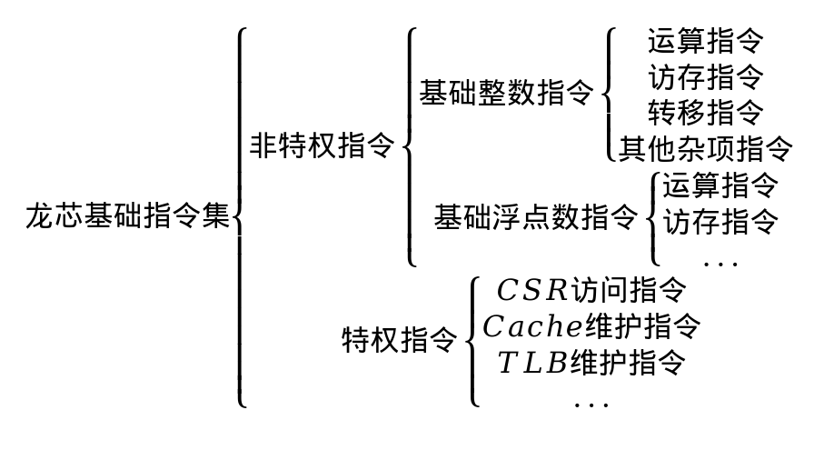

========================
LoongArch基础整数指令集
========================

LoongArch基础整数指令集包含最基本、最常用的指令集合。其中的浮点数指令集、向量指令集、二进制翻译指令集等完全符合“二八定律”，即20%的整数指令占用了80%的处理器运行时间。一个程序的大部分功能都是通过基础整数指令来实现的，最基本的减乘除等数学运算、函数调用、逻辑判断等功能都在基础整数指令集中。本章将通过多个示例介绍LoongArch中的基础整数指令的使用。

一般而言，任何指令集都有多种分类方式。龙芯基础指令集LoongArch从权限角度划分为非特权指令与特权指令；从功能角度可以划分为运算指令（包括加减乘除、移位、逻辑运算）、访存指令（负责向内存或者Cache等存储器取数或存数）、转移指令（用于控制程序执行流向）、其他杂项指令（无法归类的指令和给操作系统使用的一些指令）；从指令中使用的数据类型角度又可以划分为基础整数指令和基础浮点数指令。具体如图3-1所示。

区分非特权指令和特权指令的目的是让计算机变得更好用、更安全。操作系统通过特权指令系统管理计算机，使得应用程序形成独占CPU的假象，并使应用间相互隔离，互不干扰。现代计算机的操作系统都实现了保护模式，至少需要用户态和核心态两种运行模式，应用运行在用户态模式下，操作系统运行在核心态模式下。非特权指令可以理解为在用户态运行的指令，其内容包括基础整数指令和基础浮点数指令。

本章将详细介绍龙芯基础整数指令的运算、访存、转移等指令，包括LA64架构和LA32架构内的指令。第04章将详细介绍基础浮点数指令的运算、访存、转移等指令。对特权指令不做介绍。

在LoongArch中，数据也是采用二进制补码的方式表示，故寄存器的最高位表示的是符号。LA32架构下，寄存器的高31位（即r[31]）如果是1，则代表负数；如果是0，则代表正数。LA64架构下，寄存器的高63位（即r[63]）如果是1，则代表负数；如果是0，则代表正数。在学习LoongArch指令集时，这是需要先清楚了解的。

.. toctree::
	:maxdepth:	2

	ch3p1.md
	ch3p2.md
	ch3p3.md
	ch3p4.md
	ch3p5.md
	ch3p6.md
	ch3p7.md